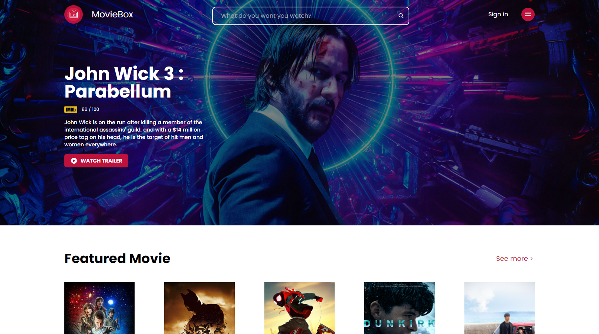

<h1 align="center">
  MovieBox
</h1>

  

  <a href="#-tecnologias">Tecnologias</a>&nbsp;&nbsp;&nbsp;|&nbsp;&nbsp;&nbsp;
  <a href="#-projeto">Projeto</a>

## 🚀 Tecnologias

Esse projeto foi desenvolvido com as seguintes tecnologias:

- HTML
- [Tailwind CSS](https://tailwindcss.com/)

## 🚧 Projeto:

Finalizado

## 🎨 Inspiração:

Figma: https://www.figma.com/file/uEVAVTKSL39S5vQ641Dybg/MovieBox-(Community)?node-id=1220%3A324

---

Feito com ♥ by Matheusvgdr